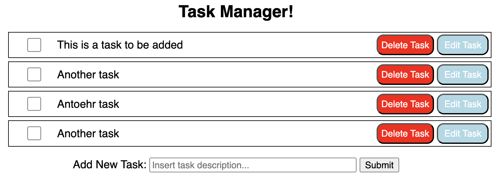

# intro-webd-workshop

This is a workshop on building a basic CRUD app using vanilla HTML/CSS/JS, Flask, and Sqlite
as our stack for Hack@Brown. The objective is to build a basic Task Manager app that supports adding, 
deleting, and editing tasks. The backend will use a SQLite database managed with Flask-SQLAlchemy while 
the frontend will be vanilla HTML/CSS/JS. See the linked presentation for further details on the 
design & background prerequisites: https://docs.google.com/presentation/d/12Ao5XhFjfeEqyMo5gM7KJQlm8gdxbK484Wqi7PThRe4/edit#slide=id.p 

Here is what the app should look like once some tasks are added: 

To install the dependencies: 
1. Create a new virtual environment by running python3 -m venv .venv. This will create a new virtual environment
called .venv in your current working directory. Make sure you have python3 installed first
2. Next cd into .venv/ 
3. Run source ./bin/activate/ 
4. cd out of .venv/ into the level containing 'requirements.txt'. Run pip install -r requirements.txt

To create and run the development version of the web-app: 
1. cd into src/ 
2. From there run flask --app app run 
3. The dev website will open up on a localhost port in a new window, from there you can modify it as you like

